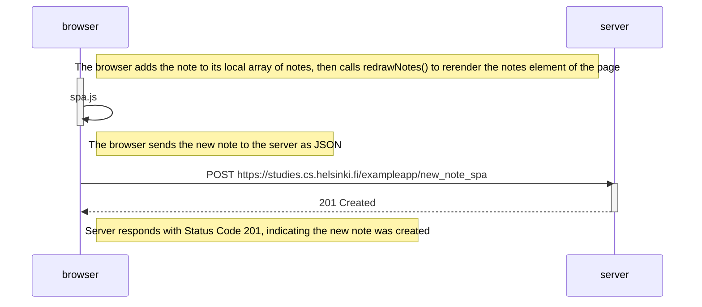

```mermaid
sequenceDiagram
    participant browser
    participant server
    
	Note right of browser: The browser adds the note to its local array of notes, then calls redrawNotes() to rerender the notes element of the page
    activate browser
	browser ->> browser: spa.js
    deactivate browser

	Note right of browser: The browser sends the new note to the server as JSON
    browser->>server: POST https://studies.cs.helsinki.fi/exampleapp/new_note_spa
    activate server
    server-->>browser: 201 Created
    deactivate server
    Note right of browser: Server responds with Status Code 201, indicating the new note was created
```